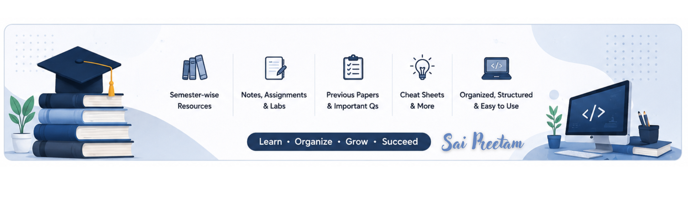

<div align="center">

# 🎓 BSc Computer Science Knowledge Hub

### A Curated Semester-wise Digital Library of My Bachelor's Journey in Computer Science




</div>

---

# 📖 About this Repository

Welcome to my personal academic knowledge archive.

This repository documents my complete Bachelor of Science (Computer Science) journey through a structured collection of semester-wise study resources. It serves as both a long-term academic archive and a centralized knowledge base for learning, revision, and reference.

The primary objective of this repository is to organize all learning materials in a systematic manner while preserving the progression of concepts covered throughout the degree.

Whether you are:

- 🎓 A Computer Science student
- 💻 A beginner exploring programming
- 📚 Looking for revision materials
- 🚀 Preparing for interviews
- 🧠 Interested in structured academic resources

I hope this repository provides useful guidance throughout your learning journey.

---

# ✨ Repository Highlights

✔ Semester-wise Organization

✔ Course-wise Resource Management

✔ Lecture Notes

✔ Handwritten Notes

✔ Assignments

✔ Lab Manuals

✔ Practical Programs

✔ Presentations

✔ Previous Year Question Papers

✔ Reference Books

✔ Cheat Sheets

✔ Project Documentation

✔ Continuous Repository Updates

---

# 🗂 Repository Structure

```
BSc-Computer-Science-Knowledge-Hub

├── Semester-01
├── Semester-02
├── Semester-03
├── Semester-04
├── Semester-05
├── Semester-06
├── Semester-07
│
├── Extras
│
└── Assets
```

---

# 📚 Semester Overview

| Semester | Status |
|-----------|----------|
| Semester I | ✅ Completed |
| Semester II | ✅ Completed |
| Semester III | ✅ Completed |
| Semester IV | ✅ Completed |
| Semester V | ✅ Completed |
| Semester VI | ✅ Completed |
| Semester VII | 🚧 Under Organization |

---

# 📂 Resources Included

This repository contains a wide variety of academic resources, including:

- 📘 Lecture Notes
- 📝 Assignments
- 💻 Laboratory Manuals
- 📄 Previous Year Question Papers
- 📊 Presentations
- 📖 Reference Books
- 🧾 Practical Records
- 📚 Study Material
- 📌 Important Questions
- 🧠 Cheat Sheets
- 🚀 Mini Projects
- 📑 Reports

---

# 🎯 Purpose

The aim of maintaining this repository is to:

- Preserve my complete academic journey.
- Build a centralized learning archive.
- Make semester-wise revision easier.
- Maintain organized course resources.
- Continuously improve documentation habits.
- Share useful resources with fellow learners.

---

# 🚀 Future Improvements

Planned additions include:

- Handwritten Notes
- Interactive Mind Maps
- Flash Cards
- Interview Preparation Resources
- Competitive Programming Notes
- AI & Machine Learning Resources
- Personal Revision Notes
- Practical Demonstrations
- Subject Summaries

---

# 📌 Repository Philosophy

> "Knowledge grows when it is organized, documented, and shared."

This repository reflects not only what I studied but also how I approached learning—through consistency, organization, and continuous improvement.

---

# 🤝 Contributions

This repository primarily serves as my personal academic archive.

Suggestions for improvements, corrections, or additional resources are always welcome through Issues or Pull Requests.

---

# ⭐ Support

If you find this repository useful, consider giving it a ⭐.

It motivates me to continue improving and expanding this knowledge base.

---

<div align="center">

### 🎓 Learning Never Stops.

**Happy Learning!**

Made with ❤️ by **A. Saipreetam**

</div>
